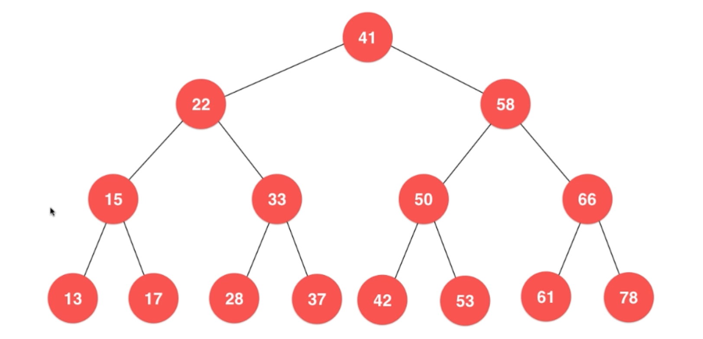

- 数组
- 队列
- 栈
- 二分搜索树
    1. 二分搜索树是一棵二叉树
    2. 二分搜索树的每个节点的值
        - 大于其左子树的所有节点的值
        - 小于其右子树的所有节点的值
        - 存储的元素必须有可比较性
        
         
    3. 每一棵子树也是二分搜索树
    4. 二分搜索树不一定是满二叉树
    5. 遍历操作
        
        [二分搜索树的遍历与实现](https://www.jianshu.com/p/3a083c3b9439)
        - 前序遍历
        
            1. 访问该节点
            2. 访问左子树
            3. 访问右子树
        - 中序遍历 (在树中排序的结果)
            1. 访问左子树
            2. 访问该节点
            3. 访问右子树
        - 后序遍历
            1. 访问左子树
            2. 访问右子树
            3. 访问该节点
        
        非递归操作：利用栈记录之后要遍历那个元素   
        
        - 层序遍历
            （队列实现）
            1. 从高到低
            2. 从左到右
            
        广度优先遍历：能更快找到问题的解 最短路径
        
        - 查找最小节点
        
           二分搜索树中最小节点应该是左子树的叶子节点。利用递归搜索
            
        - 查找最大节点 